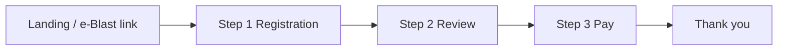

# Product Specification – Event RSVP / IAIS-style Registration (Web & Email)

**Phiên bản tài liệu:** 1.0  
**Ngày:** 2026-03-26  
**Workspace:** `event-rsvp`  
**Tham chiếu thiết kế:** Figma *IAIS | Registration Form Web* (`DHXxjezs7iMK1vq3IEQ18R`); FigJam *Registration / IAIS Demo* (flow IAIS & AIF).

---

## 1. Tóm tắt điều hành

### 1.1 Vấn đề

Tổ chức sự kiện (hội nghị, AGM, diễn đàn) cần thu **đăng ký có cấu trúc** (thông tin cá nhân, lựa chọn tham dự, thanh toán), gửi **email** theo từng giai đoạn (xác nhận nhận form, thanh toán, xác nhận cuối), và (sau này) hỗ trợ **đa ngôn ngữ** và **in badge** onsite.

### 1.2 Giải pháp (sản phẩm)

Ứng dụng **web** cho phép người dùng cuối hoàn thành **luồng nhiều bước**: **Đăng ký → Xem lại → Thanh toán → Cảm ơn**, với backend lưu bản ghi đăng ký, tính phí theo lựa chọn, và **gửi email** qua nhà cung cấp giao dịch email (ví dụ Resend, SendGrid).

### 1.3 Giai đoạn ưu tiên (theo yêu cầu stakeholder)

| Giai đoạn | Trọng tâm | Ghi chú |
|-----------|-----------|---------|
| **Demo / MVP** | Web form + email (acknowledge, confirmation cơ bản) | Có thể mock thanh toán hoặc Stripe test mode |
| **Tiếp theo** | Thanh toán đầy đủ (Stripe + bank transfer + quy trình manual) | Theo FigJam IAIS |
| **Sau đó** | Đa ngôn ngữ (AIF: EN/TC/SC), admin phê duyệt batch, QR/badge, onsite | Tách khỏi MVP demo |

---

## 2. Đối tượng & ngữ cảnh sử dụng

### 2.1 Personas

| Persona | Mục tiêu |
|---------|----------|
| **Người đăng ký (Delegate)** | Điền form, thanh toán (nếu có), nhận email xác nhận / nhắc. |
| **Ban tổ chức / Admin** | (MVP tùy chọn) Xem danh sách đăng ký, xuất CSV, trigger gửi email; (full) phê duyệt batch, xử lý bank transfer. |
| **Hệ thống email** | Gửi transactional email theo template và ngôn ngữ. |

### 2.2 Kênh

- **Web:** responsive, ưu tiên desktop ~1440px theo Figma; mobile readable.
- **Email:** HTML + plain text fallback (khuyến nghị); cùng ngôn ngữ với bước đăng ký khi có i18n.

---

## 3. Phạm vi chức năng

### 3.1 Trong phạm vi (MVP demo – Web & Email)

1. **Trang sự kiện / landing** (tĩnh hoặc CMS đơn giản): tên sự kiện, ngày giờ, địa điểm, CTA “Đăng ký”.
2. **Wizard đăng ký 3 bước** (theo Figma *Physical Registration Form*):
   - **Bước 1 – Registration:** form đầy đủ field (xem mục 5).
   - **Bước 2 – Review:** chỉ đọc + chỉnh quay lại bước 1.
   - **Bước 3 – Pay:** hiển thị tổng tiền; lựa chọn Stripe hoặc Bank transfer (UI); MVP có thể chỉ một phương thức hoặc “simulate success”.
3. **Trang Thank you** sau khi hoàn tất (bước cuối flow).
4. **Email:**
   - **Acknowledge:** sau khi submit bước 1 hoặc sau bước 2 (quyết định product – khuyến nghị: sau khi user “Continue to Review” từ bước 1 = đã có draft chắc chắn hơn; hoặc sau submit cuối bước 2 trước Pay).
   - **Confirmation:** sau thanh toán thành công hoặc sau admin approve (full product); MVP: sau Pay thành công.
   - *(Tùy chọn MVP)* **Reminder** / **Thank you post-event:** có thể lên lịch sau hoặc bỏ trong demo ngắn.
5. **Lưu trữ:** bản ghi đăng ký + trạng thái thanh toán + log email (ít nhất loại email + timestamp + recipient).

### 3.2 Trong phạm vi (full product – backlog từ FigJam)

- Phân nhánh **audience** (IAIS: Members, Industry, Press/External, Virtual…) ảnh hưởng giá / form – có thể model bằng `registration_type` hoặc URL riêng.
- **Stripe** + **Bank transfer** với upload slip + **manual verify** + email thủ công.
- **IA Approve – gửi batch thứ Sáu 12:00** (manual gate trước confirmation có QR/login magic link).
- Email confirmation: **QR**, số đăng ký duy nhất, **magic link đăng nhập** (không password), receipt.
- **AIF:** song song **Online** vs **Physical** registration; **EN / 繁 / 简**; tích hợp nền tảng bên thứ ba (ví dụ “Jacky’s platform”) – định nghĩa API sau.
- **Onsite:** quét QR / tìm tên / in badge – **ngoài scope MVP Web & Email**.

### 3.3 Ngoài phạm vi (hiện tại)

- App mobile native.
- CRM đầy đủ, marketing automation ngoài email transactional.
- Ingestion sự kiện từ bên thứ ba kiểu EventConnect.

---

## 4. Luồng người dùng (User flows)

### 4.1 Luồng chính (Delegate)

- Người dùng có thể **lưu draft** (tùy chọn kỹ thuật: localStorage hoặc server draft token) – không bắt buộc MVP.
- Validation: không cho qua bước tiếp nếu thiếu field bắt buộc (*).

### 4.2 Luồng email (MVP)

| Sự kiện kích hoạt | Email | Nội dung tối thiểu |
|-------------------|--------|---------------------|
| Sau Review confirm (hoặc sau Reg tùy chọn) | Acknowledge | Mã tham chiếu đăng ký, tóm tắt lựa chọn, hướng dẫn thanh toán nếu còn nợ |
| Sau thanh toán thành công | Payment complete / Confirmation | Số đăng ký, tóm tắt thanh toán; (sau MVP) QR + magic link |

### 4.3 Luồng admin (tùy MVP)

- Danh sách đăng ký + lọc theo trạng thái thanh toán + export CSV.
- Không bắt buộc cho demo tuần đầu nếu thời gian chật.

---

## 5. Yêu cầu chi tiết – Form (bước Registration)

Tham chiếu frame Figma *1440p Physical Registration Form*; có thể tinh giản field cho demo.

**Đối chiếu Figma:** Không chỉ layout — mọi **chuỗi hiển thị** (kể cả đoạn dài CPD, Ack, Future, footer) phải lấy từ text layer Figma hoặc bản copy stakeholder; checklist: `.design/DNA.md` (mục *Figma parity — layout và nội dung*).

### 5.1 Chrome UI

- Header: logo / branding sự kiện (placeholder được).
- **Progress:** 3 bước – Registration (active) → Review → Pay.
- **Language selector:** dropdown (MVP: English only; chuẩn bị key i18n cho sau).

### 5.2 Khối nội dung

| Khối | Field / hành vi | Bắt buộc |
|------|------------------|----------|
| **Event info** | Ngày, giờ, địa điểm, mô tả ngắn (read-only từ config event) | – |
| **Attendance** | Radio: In person (giá A) / Online (giá B) / Will not attend | Có |
| **Lunch** (nếu in person) | Radio: phiên ăn trưa / Will not attend | Theo rule: chỉ hiện khi in person |
| **Dietary** | Radio: No preference / Vegetarian / Halal | Có khi có lunch |
| **Personal details** | Title, First name, Last name, Company, Job title, Email, Phone (country + number), Country/Region | Email + tên tối thiểu cho MVP rút gọn |
| **Contact person** | Cùng cụm field như Personal (cho người liên hệ thay thế) | Tùy business – spec đầy đủ: giống Figma |
| **CPD** | Radio Yes/No + note giải thích | Tùy sự kiện |
| **Consent** | Checkbox đồng ý điều khoản | Có |
| **Marketing opt-in** | Checkbox nhận tin (optional) | Không |
| CTA | Nút **Continue to Review** | – |

### 5.3 Validation

- Email: định dạng RFC hợp lý; normalize trim.
- Phone: validate theo country code (MVP: optional lỏng).
- Giá hiển thị theo **Attendance** (ví dụ HKD 500 / 100) – config theo `event` hoặc env.

### 5.4 Review & Pay

- **Review:** render read-only toàn bộ lựa chọn + tổng tiền; nút Back + Confirm.
- **Pay:** tổng tiền; nếu “Will not attend” có thể **0 đồng** và bỏ qua cổng thanh toán (quyết định product – ghi rõ trong `decisions.md` khi implement).

---

## 6. Thanh toán

### 6.1 Stripe (ưu tiên kỹ thuật cho demo)

- Checkout Session hoặc Payment Intent; webhook xác nhận `payment_intent.succeeded`.
- Test mode cho môi trường dev/demo.

### 6.2 Bank transfer (full product)

- Hiển thị hướng dẫn + số tài khoản + **reference number** unique.
- Upload payment slip (file) – lưu object storage hoặc DB metadata.
- Trạng thái: `pending_verification` → admin xác nhận → gửi confirmation.

---

## 7. Phi chức năng (NFR)

| Hạng mục | Mục tiêu MVP |
|----------|----------------|
| **Bảo mật** | HTTPS; không log PAN/secret; token đăng ký public không đoán được; rate limit submit/API |
| **Privacy** | Chính sách & link privacy trên form; consent checkbox bắt buộc |
| **Hiệu năng** | LCP hợp lý trên 4G; form không block UI không cần thiết |
| **Khả dụng** | Label khớp input; focus order; contrast cơ bản (WCAG khuyến nghị sau) |
| **Observability** | Log lỗi server; log gửi email (success/fail) không chứa PII full |

---

## 8. Mô hình dữ liệu (logical)

Bổ sung / thay thế entity RSVP đơn giản trong `agent/knowledge/02-schema-and-data.md` khi implement.

### 8.1 Event

- `id`, `slug`, `title`, `starts_at`, `ends_at`, `timezone`, `location_label`, `default_language`
- `pricing_config` (JSON): ví dụ `{ "in_person_cents": 50000, "online_cents": 10000 }`
- `settings` (JSON): bật/tắt lunch, CPD, contact person required, v.v.

### 8.2 Registration (bản ghi đăng ký)

- `id` (UUID), `event_id`, `public_token` (cho resume link – optional)
- `status`: `draft` | `submitted` | `pending_payment` | `paid` | `cancelled`
- `attendance`: `in_person` | `online` | `not_attending`
- `form_payload` (JSON): toàn bộ field form (personal, contact, lunch, dietary, CPD, consents)
- `amount_due_cents`, `currency`
- `payment_provider`, `payment_reference` (Stripe id hoặc bank ref)
- `created_at`, `updated_at`

### 8.3 EmailLog

- `id`, `registration_id`, `template_key`, `to_email`, `status`, `provider_message_id`, `created_at`

### 8.4 User / Admin (optional)

- Bảng `users` nếu có admin login; MVP có thể bảo vệ `/admin` bằng basic auth hoặc secret path cho demo.

---

## 9. API & tích hợp (gợi ý)

- `POST /api/registrations` – tạo/cập nhật draft.
- `POST /api/registrations/:id/submit` – chốt bước review → pending payment.
- `POST /api/webhooks/stripe` – cập nhật paid + queue confirmation email.
- `POST /api/internal/send-ack` – (optional) worker gửi email.

Chi tiết mở rộng khi chọn framework (Next.js Route Handlers + server actions, v.v.).

---

## 10. Stack đề xuất (đồng bộ convention repo)

- **Frontend:** Next.js (App Router), TypeScript, **Tailwind CSS**.
- **UI:** shadcn/ui hoặc tương đương; form **React Hook Form + Zod**.
- **DB:** PostgreSQL (khuyến nghị) hoặc SQLite cho demo local.
- **ORM:** Prisma hoặc Drizzle.
- **Email:** Resend / SendGrid / Postmark (một provider).
- **Payment:** Stripe.

---

## 11. Tiêu chí chấp nhận (acceptance) – MVP demo

1. User mở URL sự kiện, điền form bắt buộc, xem Review, vào Pay (hoặc skip nếu 0 đồng).
2. Dữ liệu lưu DB (hoặc persist tối thiểu chứng minh được).
3. Ít nhất **một** email gửi được tới inbox test (acknowledge hoặc confirmation).
4. Trang Thank you hiển thị sau flow thành công.
5. Không lộ secret trên client; validation lỗi hiển thị rõ trên field.

---

## 12. Rủi ro & giả định

- **Giả định:** stakeholder cung cấp copy chính thức (điều khoản, privacy), logo, và giá chính xác.
- **Rủi ro:** phạm vi FigJam lớn (IAIS + AIF + onsite) – demo tuần tới chỉ cắt **một** vertical (ví dụ chỉ IAIS EN + một form).
- **Pháp lý:** nội dung email & thu thập dữ liệu cá nhân do phía khách hàng chịu trách nhiệm cuối.

---

## 13. Tài liệu liên quan trong repo

- `agent/knowledge/00-project-overview.md` – overview ngắn.
- `agent/knowledge/02-schema-and-data.md` – schema; cần đồng bộ với mục 8 khi code.
- `agent/knowledge/03-figma-and-design-sources.md` – **file key Figma**, frame/node chính, URL mẫu; liên kết tới `.design/DNA.md`.
- `agent/rules/domain-rules.md` – rule nghiệp vụ & privacy.
- FigJam / Figma: link đầy đủ trong knowledge `03`; không commit file nhị phân Figma vào git.

---

## 14. Lịch sử phiên bản

| Phiên bản | Ngày | Thay đổi |
|-----------|------|----------|
| 1.0 | 2026-03-26 | Khởi tạo spec từ Figma + FigJam + scope Web & Email |
